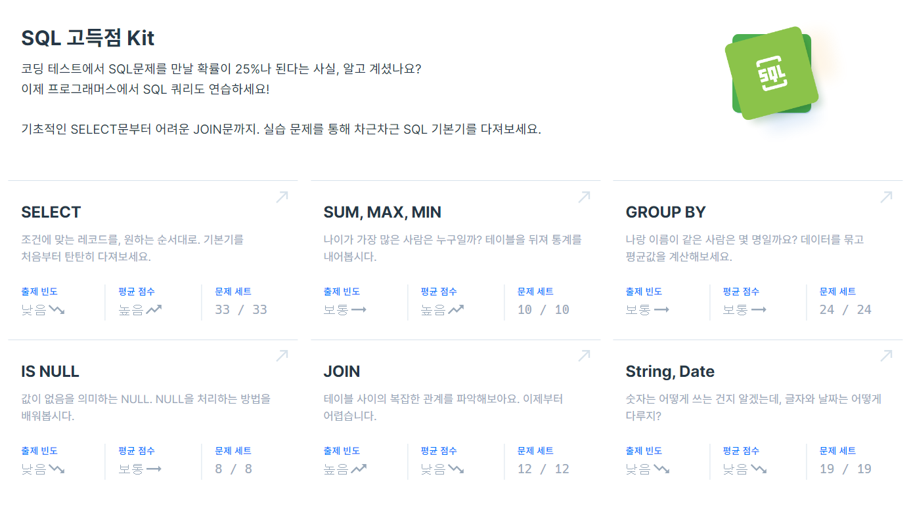

# 제목

## SQL

NoSQL

### mongodb fuctions
- insertOne() : 
db.car_info.insertOne({...})
#명령어 설명 예시 정리 필요

- inserMany() 
db.posts.deleteMany({ category: "Event" })
{
  acknowledged: true,
  deletedCount: 4
}

db.posts.deleteMany({})
{
  acknowledged: true,
  deletedCount: 1
}

-find()
db.fruits.find({})

-db.posts.find({}, {_id:1, title:1, category:1, likes:1}) ;

-db.posts.updateMany({}, {$inc : {likes : 1} }) ;

 

## 개념 정리
- [NOSQL 개념 정리]()
- [MYSQL 개념 정리]()

 

## file 정리

NOSQL

|구분|파일명|적용내용|파일내용|비고|
|--|--|--|--|--|
|1|||||
|2|||||
|3|||||
|4|||||
|5|||||
|6|||||
|7|||||
|8|||||
|9|||||
|10|||||
|11|||||
|12|||||

NOSQL QUEST

|구분|파일명|적용내용|파일내용|비고|
|--|--|--|--|--|
|1|||||
|2|||||
|3|||||
|4|||||
|5|||||
|6|||||
|7|||||
|8|||||
|9|||||
|10|||||
|11|||||
|12|||||

MYSQL

|구분|파일명|적용내용|파일내용|비고|
|--|--|--|--|--|
|1|||||
|2|||||
|3|||||
|4|||||
|5|||||
|6|||||
|7|||||
|8|||||
|9|||||
|10|||||
|11|||||
|12|||||

MYSQL QUEST

|구분|파일명|적용내용|파일내용|비고|
|--|--|--|--|--|
|1|[STUDY_BOARDS.sql](./SQLs/quests/STUDY_BOARDS.sql)||||
|2|[STUDY_CARS.sql](./SQLs/quests/STUDY_CARS.sql)||||
|3|[STUDY_USERS.sql](./SQLs/quests/STUDY_USERS.sql)||||
|4|[STUDY_MOVIES.sql](./SQLs/quests/STUDY_MOVIES.sql)||||
|5|[notice_inserts.sql](./SQLs/quests/notice_inserts.sql)||||
|6|[notice_deletes.sql](./SQLs/quests/notice_deletes.sql)||||
|7|[STUDY_USERSwithInestSQL.sql](./SQLs/quests/)||||
|8|[selectwhereRangeAndEquals.sql](./SQLs/quests/selectwhereRangeAndEquals.sql)||||
|9|[select_group_havings_orderby.sql](./SQLs/quests/select_group_havings_orderby.sql)||||
|10|[select_subquerys.sql](./SQLs/quests/select_subquerys.sql)||||
|11|[select_joins.sql](./SQLs/quests/select_joins.sql)||||
|12|[select_alls.sql](./SQLs/quests/select_alls.sql)||||
|13|[common_codes.sql]()||||

 

## Coding Test

  
프로그래머스

  
|NO|구분|소스|문제설명|출처|
|--|--|--|--|--|
|1|IS NULL|[SQL](./SQLs/codingtest/131114.sql)|경기도에 위치한 식품창고 목록 출력하기|[프로그래머스 131114](https://school.programmers.co.kr/learn/courses/30/lessons/131114)|
|2|IS NULL|[SQL](./SQLs/codingtest/59039.sql)|이름이 없는 동물의 아이디|[프로그래머스 59039](https://school.programmers.co.kr/learn/courses/30/lessons/59039)|
|3|IS NULL|[SQL](./SQLs/codingtest/59407.sql)|이름이 있는 동물의 아이디|[프로그래머스 59407](https://school.programmers.co.kr/learn/courses/30/lessons/59407)|
|4|IS NULL|[SQL](./SQLs/codingtest/59410.sql)|NULL 처리하기|[프로그래머스 59410](https://school.programmers.co.kr/learn/courses/30/lessons/59410)|
|5|IS NULL|[SQL](./SQLs/codingtest/131528.sql)|나이 정보가 없는 회원 수 구하기|[프로그래머스 131528](https://school.programmers.co.kr/learn/courses/30/lessons/131528)|
|6|IS NULL|[SQL](./SQLs/codingtest/273710.sql)|ROOT 아이템 구하기|[프로그래머스 273710](https://school.programmers.co.kr/learn/courses/30/lessons/273710)|
|7|IS NULL|[SQL](./SQLs/codingtest/273712.sql)|업그레이드 할 수 없는 아이템 구하기|[프로그래머스 273712](https://school.programmers.co.kr/learn/courses/30/lessons/273712)|
|8|IS NULL|[SQL](./SQLs/codingtest/293259.sql)|잡은 물고기의 평균 길이 구하기|[프로그래머스 293259](https://school.programmers.co.kr/learn/courses/30/lessons/293259)|
|9|SUM, MAX, MIN|[SQL](./SQLs/codingtest/131697.sql)|가장 비싼 상품 구하기|[프로그래머스 131697](https://school.programmers.co.kr/learn/courses/30/lessons/131697)|
|10|SUM, MAX, MIN|[SQL](./SQLs/codingtest/131115.sql)|가격이 제일 비싼 식품의 정보 출력하기|[프로그래머스 131115](https://school.programmers.co.kr/learn/courses/30/lessons/131115)|
|11|SUM, MAX, MIN|[SQL](./SQLs/codingtest/59415.sql)|최댓값 구하기|[프로그래머스 59415](https://school.programmers.co.kr/learn/courses/30/lessons/59415)|
|12|SUM, MAX, MIN|[SQL](./SQLs/codingtest/59038.sql)|최솟값 구하기|[프로그래머스 59038](https://school.programmers.co.kr/learn/courses/30/lessons/59038)|
|13|SUM, MAX, MIN|[SQL](./SQLs/codingtest/59406.sql)|동물 수 구하기|[프로그래머스 59406](https://school.programmers.co.kr/learn/courses/30/lessons/59406)|
|14|SUM, MAX, MIN|[SQL](./SQLs/codingtest/59408.sql)|중복 제거하기|[프로그래머스 59408](https://school.programmers.co.kr/learn/courses/30/lessons/59408)|
|15|SUM, MAX, MIN|[SQL](./SQLs/codingtest/273709.sql)|조건에 맞는 아이템들의 가격의 총합 구하기|[프로그래머스 273709](https://school.programmers.co.kr/learn/courses/30/lessons/273709)|
|16|SUM, MAX, MIN|[SQL](./SQLs/codingtest/293261.sql)|물고기 종류 별 대어 찾기|[프로그래머스 293261](https://school.programmers.co.kr/learn/courses/30/lessons/293261)|
|17|SUM, MAX, MIN|[SQL](./SQLs/codingtest/298515.sql)|잡은 물고기 중 가장 큰 물고기의 길이 구하기|[프로그래머스 298515](https://school.programmers.co.kr/learn/courses/30/lessons/298515)|
|18|SUM, MAX, MIN|[SQL](./SQLs/codingtest/299310.sql)|연도별 대장균 크기의 편차 구하기 |[프로그래머스 299310](https://school.programmers.co.kr/learn/courses/30/lessons/299310)|
|19|SELECT|[SQL](./SQLs/codingtest/151136.sql)|평균 일일 대여 요금 구하기|[프로그래머스 151136](https://school.programmers.co.kr/learn/courses/30/lessons/151136)|
|20|SELECT|[SQL](./SQLs/codingtest/144853.sql)|조건에 맞는 도서 리스트 출력하기|[프로그래머스 144853](https://school.programmers.co.kr/learn/courses/30/lessons/144853)|
|21|SELECT|[SQL](./SQLs/codingtest/132201.sql)|12세 이하인 여자 환자 목록 출력하기|[프로그래머스 132201](https://school.programmers.co.kr/learn/courses/30/lessons/132201)|
|22|SELECT|[SQL](./SQLs/codingtest/164673.sql)|조건에 부합하는 중고거래 댓글 조회하기|[프로그래머스 164673](https://school.programmers.co.kr/learn/courses/30/lessons/164673)|
|23|SELECT|[SQL](./SQLs/codingtest/131120.sql)|3월에 태어난 여성 회원 목록 출력하기|[프로그래머스 131120](https://school.programmers.co.kr/learn/courses/30/lessons/131120)|
|24|SELECT|[SQL](./SQLs/codingtest/132203.sql)|흉부외과 또는 일반외과 의사 목록 출력하기|[프로그래머스 132203](https://school.programmers.co.kr/learn/courses/30/lessons/132203)|
|25|SELECT|[SQL](./SQLs/codingtest/133025.sql)|과일로 만든 아이스크림 고르기|[프로그래머스 133025](https://school.programmers.co.kr/learn/courses/30/lessons/133025)|
|26|SELECT|[SQL](./SQLs/codingtest/133024.sql)|인기있는 아이스크림|[프로그래머스 133024](https://school.programmers.co.kr/learn/courses/30/lessons/133024)|
|27|SELECT|[SQL](./SQLs/codingtest/131112.sql)|강원도에 위치한 생산공장 목록 출력하기|[프로그래머스 131112](https://school.programmers.co.kr/learn/courses/30/lessons/131112)|
|28|SELECT|[SQL](./SQLs/codingtest/131118.sql)|서울에 위치한 식당 목록 출력하기|[프로그래머스 131118](https://school.programmers.co.kr/learn/courses/30/lessons/131118)|
|29|SELECT|[SQL](./SQLs/codingtest/131536.sql)|재구매가 일어난 상품과 회원 리스트 구하기|[프로그래머스 131536](https://school.programmers.co.kr/learn/courses/30/lessons/131536)|
|30|SELECT|[SQL](./SQLs/codingtest/59034.sql)|모든 레코드 조회하기|[프로그래머스 59034](https://school.programmers.co.kr/learn/courses/30/lessons/59034)|
|31|SELECT|[SQL](./SQLs/codingtest/131537.sql)|오프라인/온라인 판매 데이터 통합하기|[프로그래머스 131537](https://school.programmers.co.kr/learn/courses/30/lessons/131537)|
|32|SELECT|[SQL](./SQLs/codingtest/59035.sql)|역순 정렬하기|[프로그래머스 59035](https://school.programmers.co.kr/learn/courses/30/lessons/59035)|
|33|SELECT|[SQL](./SQLs/codingtest/59036.sql)|아픈 동물 찾기|[프로그래머스 59036](https://school.programmers.co.kr/learn/courses/30/lessons/59036)|
|34|SELECT|[SQL](./SQLs/codingtest/59037.sql)|어린 동물 찾기|[프로그래머스 59037](https://school.programmers.co.kr/learn/courses/30/lessons/59037)|
|35|SELECT|[SQL](./SQLs/codingtest/59403.sql)|동물의 아이디와 이름|[프로그래머스 59403](https://school.programmers.co.kr/learn/courses/30/lessons/59403)|
|36|SELECT|[SQL](./SQLs/codingtest/59404.sql)|여러 기준으로 정렬하기|[프로그래머스 59404](https://school.programmers.co.kr/learn/courses/30/lessons/59404)|
|37|SELECT|[SQL](./SQLs/codingtest/59405.sql)|상위 n개 레코드|[프로그래머스 59405](https://school.programmers.co.kr/learn/courses/30/lessons/59405)|
|38|SELECT|[SQL](./SQLs/codingtest/131535.sql)|조건에 맞는 회원수 구하기|[프로그래머스 131535](https://school.programmers.co.kr/learn/courses/30/lessons/131535)|
|39|SELECT|[SQL](./SQLs/codingtest/273711.sql)|업그레이드 된 아이템 구하기|[프로그래머스 273711](https://school.programmers.co.kr/learn/courses/30/lessons/273711)|
|40|SELECT|[SQL](./SQLs/codingtest/276013.sql)|Python 개발자 찾기|[프로그래머스 276013](https://school.programmers.co.kr/learn/courses/30/lessons/276013)|
|41|SELECT|[SQL](./SQLs/codingtest/276034.sql)|조건에 맞는 개발자 찾기|[프로그래머스 276034](https://school.programmers.co.kr/learn/courses/30/lessons/276034)|
|42|SELECT|[SQL](./SQLs/codingtest/293258.sql)|잔챙이 잡은 수 구하기|[프로그래머스 293258](https://school.programmers.co.kr/learn/courses/30/lessons/293258)|
|43|SELECT|[SQL](./SQLs/codingtest/298517.sql)|가장 큰 물고기 10마리 구하기|[프로그래머스 298517](https://school.programmers.co.kr/learn/courses/30/lessons/298517)|
|44|SELECT|[SQL](./SQLs/codingtest/298518.sql)|특정 물고기를 잡은 총 수 구하기|[프로그래머스 298518](https://school.programmers.co.kr/learn/courses/30/lessons/298518)|
|45|SELECT|[SQL](./SQLs/codingtest/299305.sql)|대장균들의 자식의 수 구하기|[프로그래머스 299305](https://school.programmers.co.kr/learn/courses/30/lessons/299305)|
|46|SELECT|[SQL](./SQLs/codingtest/299307.sql)|대장균의 크기에 따라 분류하기 1|[프로그래머스 299307](https://school.programmers.co.kr/learn/courses/30/lessons/299307)|
|47|SELECT|[SQL](./SQLs/codingtest/301646.sql)|특정 형질을 가지는 대장균 찾기|[프로그래머스 301646](https://school.programmers.co.kr/learn/courses/30/lessons/301646)|
|48|SELECT|[SQL](./SQLs/codingtest/301647.sql)|부모의 형질을 모두 가지는 대장균 찾기|[프로그래머스 301647](https://school.programmers.co.kr/learn/courses/30/lessons/301647)|
|49|SELECT|[SQL](./SQLs/codingtest/301649.sql)|대장균의 크기에 따라 분류하기 2|[프로그래머스 301649](https://school.programmers.co.kr/learn/courses/30/lessons/301649)|
|50|SELECT|[SQL](./SQLs/codingtest/301650.sql)|특정 세대의 대장균 찾기|[프로그래머스 301650](https://school.programmers.co.kr/learn/courses/30/lessons/301650)|
|51|SELECT|[SQL](./SQLs/codingtest/301651.sql)|멸종위기의 대장균 찾기|[프로그래머스 301651](https://school.programmers.co.kr/learn/courses/30/lessons/301651)|
|53|JOIN|[SQL](./SQLs/codingtest/133027.sql)|주문량이 많은 아이스크림들 조회하기|[프로그래머스 133027](https://school.programmers.co.kr/learn/courses/30/lessons/133027)|
|54|JOIN|[SQL](./SQLs/codingtest/131117.sql)|5월 식품들의 총매출 조회하기|[프로그래머스 131117](https://school.programmers.co.kr/learn/courses/30/lessons/131117)|
|55|JOIN|[SQL](./SQLs/codingtest/157339.sql)|특정 기간동안 대여 가능한 자동차들의 대여비용 구하기|[프로그래머스 157339](https://school.programmers.co.kr/learn/courses/30/lessons/157339)|
|56|JOIN|[SQL](./SQLs/codingtest/144854.sql)|조건에 맞는 도서와 저자 리스트 출력하기|[프로그래머스 144854](https://school.programmers.co.kr/learn/courses/30/lessons/144854)|
|57|JOIN|[SQL](./SQLs/codingtest/131124.sql)|그룹별 조건에 맞는 식당 목록 출력하기|[프로그래머스 131124](https://school.programmers.co.kr/learn/courses/30/lessons/131124)|
|58|JOIN|[SQL](./SQLs/codingtest/59042.sql)|없어진 기록 찾기|[프로그래머스 59042](https://school.programmers.co.kr/learn/courses/30/lessons/59042)|
|59|JOIN|[SQL](./SQLs/codingtest/59043.sql)|있었는데요 없었습니다|[프로그래머스 59043](https://school.programmers.co.kr/learn/courses/30/lessons/59043)|
|60|JOIN|[SQL](./SQLs/codingtest/59044.sql)|오랜 기간 보호한 동물(1)|[프로그래머스 59044](https://school.programmers.co.kr/learn/courses/30/lessons/59044)|
|61|JOIN|[SQL](./SQLs/codingtest/59045.sql)|보호소에서 중성화한 동물|[프로그래머스 59045](https://school.programmers.co.kr/learn/courses/30/lessons/59045)|
|62|JOIN|[SQL](./SQLs/codingtest/131533.sql)|상품 별 오프라인 매출 구하기|[프로그래머스 131533](https://school.programmers.co.kr/learn/courses/30/lessons/131533)|
|52|JOIN|[SQL](./SQLs/codingtest/131534.sql)|상품을 구매한 회원 비율 구하기|[프로그래머스 131534](https://school.programmers.co.kr/learn/courses/30/lessons/131534)|
|63|JOIN|[SQL](./SQLs/codingtest/276035.sql)|FrontEnd 개발자 찾기|[프로그래머스 276035](https://school.programmers.co.kr/learn/courses/30/lessons/276035)|
|64|GROUP BY|[SQL](./SQLs/codingtest/151137.sql)|자동차 종류 별 특정 옵션이 포함된 자동차 수 구하기|[프로그래머스 151137](https://school.programmers.co.kr/learn/courses/30/lessons/151137)|
|65|GROUP BY|[SQL](./SQLs/codingtest/151139.sql)|대여 횟수가 많은 자동차들의 월별 대여 횟수 구하기|[프로그래머스 151139](https://school.programmers.co.kr/learn/courses/30/lessons/151139)|
|66|GROUP BY|[SQL](./SQLs/codingtest/133026.sql)|성분으로 구분한 아이스크림 총 주문량|[프로그래머스 133026](https://school.programmers.co.kr/learn/courses/30/lessons/133026)|
|67|GROUP BY|[SQL](./SQLs/codingtest/164668.sql)|조건에 맞는 사용자와 총 거래금액 조회하기|[프로그래머스 164668](https://school.programmers.co.kr/learn/courses/30/lessons/164668)|
|68|GROUP BY|[SQL](./SQLs/codingtest/131123.sql)|즐겨찾기가 가장 많은 식당 정보 출력하기|[프로그래머스 131123](https://school.programmers.co.kr/learn/courses/30/lessons/131123)|
|69|GROUP BY|[SQL](./SQLs/codingtest/144855.sql)|카테고리 별 도서 판매량 집계하기|[프로그래머스 144855](https://school.programmers.co.kr/learn/courses/30/lessons/144855)|
|70|GROUP BY|[SQL](./SQLs/codingtest/157340.sql)|자동차 대여 기록에서 대여중 / 대여 가능 여부 구분하기|[프로그래머스 157340](https://school.programmers.co.kr/learn/courses/30/lessons/157340)|
|71|GROUP BY|[SQL](./SQLs/codingtest/132202.sql)|진료과별 총 예약 횟수 출력하기|[프로그래머스 132202](https://school.programmers.co.kr/learn/courses/30/lessons/132202)|
|72|GROUP BY|[SQL](./SQLs/codingtest/144856.sql)|저자 별 카테고리 별 매출액 집계하기|[프로그래머스 144856](https://school.programmers.co.kr/learn/courses/30/lessons/144856)|
|73|GROUP BY|[SQL](./SQLs/codingtest/131116.sql)|식품분류별 가장 비싼 식품의 정보 조회하기|[프로그래머스 131116](https://school.programmers.co.kr/learn/courses/30/lessons/131116)|
|74|GROUP BY|[SQL](./SQLs/codingtest/59040.sql)|고양이와 개는 몇 마리 있을까|[프로그래머스 59040](https://school.programmers.co.kr/learn/courses/30/lessons/59040)|
|75|GROUP BY|[SQL](./SQLs/codingtest/59041.sql)|동명 동물 수 찾기|[프로그래머스 59041](https://school.programmers.co.kr/learn/courses/30/lessons/59041)|
|76|GROUP BY|[SQL](./SQLs/codingtest/131532.sql)|년, 월, 성별 별 상품 구매 회원 수 구하기|[프로그래머스 131532](https://school.programmers.co.kr/learn/courses/30/lessons/131532)|
|77|GROUP BY|[SQL](./SQLs/codingtest/59412.sql)|입양 시각 구하기(1)|[프로그래머스 59412](https://school.programmers.co.kr/learn/courses/30/lessons/59412)|
|78|GROUP BY|[SQL](./SQLs/codingtest/59413.sql)|입양 시각 구하기(2)|[프로그래머스 59413](https://school.programmers.co.kr/learn/courses/30/lessons/59413)|
|79|GROUP BY|[SQL](./SQLs/codingtest/131530.sql)|가격대 별 상품 개수 구하기|[프로그래머스 131530](https://school.programmers.co.kr/learn/courses/30/lessons/131530)|
|80|GROUP BY|[SQL](./SQLs/codingtest/276036.sql)|언어별 개발자 분류하기|[프로그래머스 276036](https://school.programmers.co.kr/learn/courses/30/lessons/276036)|
|81|GROUP BY|[SQL](./SQLs/codingtest/284527.sql)|조건에 맞는 사원 정보 조회하기|[프로그래머스 284527](https://school.programmers.co.kr/learn/courses/30/lessons/284527)|
|82|GROUP BY|[SQL](./SQLs/codingtest/284528.sql)|연간 평가점수에 해당하는 평가 등급 및 성과금 조회하기|[프로그래머스 284528](https://school.programmers.co.kr/learn/courses/30/lessons/284528)|
|83|GROUP BY|[SQL](./SQLs/codingtest/284529.sql)|부서별 평균 연봉 조회하기|[프로그래머스 284529](https://school.programmers.co.kr/learn/courses/30/lessons/284529)|
|84|GROUP BY|[SQL](./SQLs/codingtest/284531.sql)|노선별 평균 역 사이 거리 조회하기|[프로그래머스 284531](https://school.programmers.co.kr/learn/courses/30/lessons/284531)|
|85|GROUP BY|[SQL](./SQLs/codingtest/293257.sql)|물고기 종류 별 잡은 수 구하기|[프로그래머스 293257](https://school.programmers.co.kr/learn/courses/30/lessons/293257)|
|86|GROUP BY|[SQL](./SQLs/codingtest/293260.sql)|월별 잡은 물고기 수 구하기|[프로그래머스 293260](https://school.programmers.co.kr/learn/courses/30/lessons/293260)|
|87|GROUP BY|[SQL](./SQLs/codingtest/298519.sql)|특정 조건을 만족하는 물고기별 수와 최대 길이 구하기|[프로그래머스 298519](https://school.programmers.co.kr/learn/courses/30/lessons/298519)|
|88|String, Date|[SQL](./SQLs/codingtest/164671.sql)|조회수가 가장 많은 중고거래 게시판의 첨부파일 조회하기|[프로그래머스 164671](https://school.programmers.co.kr/learn/courses/30/lessons/164671)|
|89|String, Date|[SQL](./SQLs/codingtest/157343.sql)|특정 옵션이 포함된 자동차 리스트 구하기|[프로그래머스 157343](https://school.programmers.co.kr/learn/courses/30/lessons/157343)|
|90|String, Date|[SQL](./SQLs/codingtest/151141.sql)|자동차 대여 기록 별 대여 금액 구하기|[프로그래머스 151141](https://school.programmers.co.kr/learn/courses/30/lessons/151141)|
|91|String, Date|[SQL](./SQLs/codingtest/164672.sql)|조건에 부합하는 중고거래 상태 조회하기|[프로그래머스 164672](https://school.programmers.co.kr/learn/courses/30/lessons/164672)|
|92|String, Date|[SQL](./SQLs/codingtest/131113.sql)|조건별로 분류하여 주문상태 출력하기|[프로그래머스 131113](https://school.programmers.co.kr/learn/courses/30/lessons/131113)|
|93|String, Date|[SQL](./SQLs/codingtest/164670.sql)|조건에 맞는 사용자 정보 조회하기|[프로그래머스 164670](https://school.programmers.co.kr/learn/courses/30/lessons/164670)|
|94|String, Date|[SQL](./SQLs/codingtest/157341.sql)|대여 기록이 존재하는 자동차 리스트 구하기|[프로그래머스 157341](https://school.programmers.co.kr/learn/courses/30/lessons/157341)|
|95|String, Date|[SQL](./SQLs/codingtest/151138.sql)|자동차 대여 기록에서 장기/단기 대여 구분하기|[프로그래머스 151138](https://school.programmers.co.kr/learn/courses/30/lessons/151138)|
|96|String, Date|[SQL](./SQLs/codingtest/157342.sql)|자동차 평균 대여 기간 구하기|[프로그래머스 157342](https://school.programmers.co.kr/learn/courses/30/lessons/157342)|
|97|String, Date|[SQL](./SQLs/codingtest/132204.sql)|취소되지 않은 진료 예약 조회하기|[프로그래머스 132204](https://school.programmers.co.kr/learn/courses/30/lessons/132204)|
|98|String, Date|[SQL](./SQLs/codingtest/59046.sql)|루시와 엘라 찾기|[프로그래머스 59046](https://school.programmers.co.kr/learn/courses/30/lessons/59046)|
|99|String, Date|[SQL](./SQLs/codingtest/59047.sql)|이름에 el이 들어가는 동물 찾기|[프로그래머스 59047](https://school.programmers.co.kr/learn/courses/30/lessons/59047)|
|100|String, Date|[SQL](./SQLs/codingtest/59409.sql)|중성화 여부 파악하기|[프로그래머스 59409](https://school.programmers.co.kr/learn/courses/30/lessons/59409)|
|101|String, Date|[SQL](./SQLs/codingtest/59411.sql)|오랜 기간 보호한 동물(2)|[프로그래머스 59411](https://school.programmers.co.kr/learn/courses/30/lessons/59411)|
|102|String, Date|[SQL](./SQLs/codingtest/131529.sql)|카테고리 별 상품 개수 구하기|[프로그래머스 131529](https://school.programmers.co.kr/learn/courses/30/lessons/131529)|
|103|String, Date|[SQL](./SQLs/codingtest/59414.sql)|DATETIME에서 DATE로 형 변환|[프로그래머스 59414](https://school.programmers.co.kr/learn/courses/30/lessons/59414)|
|104|String, Date|[SQL](./SQLs/codingtest/284530.sql)|연도 별 평균 미세먼지 농도 조회하기|[프로그래머스 284530](https://school.programmers.co.kr/learn/courses/30/lessons/284530)|
|105|String, Date|[SQL](./SQLs/codingtest/298516.sql)|한 해에 잡은 물고기 수 구하기|[프로그래머스 298516](https://school.programmers.co.kr/learn/courses/30/lessons/298516)|
|106|String, Date|[SQL](./SQLs/codingtest/299308.sql)|분기별 분화된 대장균의 개체 수 구하기|[프로그래머스 299308](https://school.programmers.co.kr/learn/courses/30/lessons/299308)|

🤗프로그래머스 완료!🤗

  
해커랭크

|NO|구분|소스|문제설명|출처|
|--|--|--|--|--|
|1|Basic Select|[SQL](./SQLs/codingtest/HackerRank_001.sql)|Revising the Select Query I|[해커랭크 001](https://www.hackerrank.com/challenges/revising-the-select-query/problem?isFullScreen=true)|
|2|Basic Select|[SQL](./SQLs/codingtest/HackerRank_002.sql)|Revising the Select Query II|[해커랭크 002](https://www.hackerrank.com/challenges/revising-the-select-query-2/problem?isFullScreen=true)|
|3|Basic Select|[SQL](./SQLs/codingtest/HackerRank_003.sql)|Select All|[해커랭크 003](https://www.hackerrank.com/challenges/select-all-sql/problem?isFullScreen=true)|
|4|Basic Select|[SQL](./SQLs/codingtest/HackerRank_004.sql)|Select By ID|[해커랭크 004](https://www.hackerrank.com/challenges/select-by-id/problem?isFullScreen=true)|
|5|Basic Select|[SQL](./SQLs/codingtest/HackerRank_005.sql)|Japanese Cities' Attributes|[해커랭크 005](https://www.hackerrank.com/challenges/japanese-cities-attributes/problem?isFullScreen=true)|
|6|Basic Select|[SQL](./SQLs/codingtest/HackerRank_006.sql)|Japanese Cities' Names|[해커랭크 006](https://www.hackerrank.com/challenges/japanese-cities-name/problem?isFullScreen=true)|
|7|Basic Select|[SQL](./SQLs/codingtest/HackerRank_007.sql)|Weather Observation Station 1|[해커랭크 007](https://www.hackerrank.com/challenges/weather-observation-station-1/problem?isFullScreen=true)|
|8|Basic Select|[SQL](./SQLs/codingtest/HackerRank_008.sql)|Weather Observation Station 3|[해커랭크 008](https://www.hackerrank.com/challenges/weather-observation-station-3/problem?isFullScreen=true)|
|9|Basic Select|[SQL](./SQLs/codingtest/HackerRank_009.sql)|Weather Observation Station 4|[해커랭크 009](https://www.hackerrank.com/challenges/weather-observation-station-4/problem?isFullScreen=true)|
|10|Basic Select|[SQL](./SQLs/codingtest/HackerRank_010.sql)|Weather Observation Station 5|[해커랭크 010](https://www.hackerrank.com/challenges/weather-observation-station-5/problem?isFullScreen=true)|
|11|Basic Select|[SQL](./SQLs/codingtest/HackerRank_011.sql)|Weather Observation Station 6|[해커랭크 011](https://www.hackerrank.com/challenges/weather-observation-station-6/problem?isFullScreen=true)|
|12|Basic Select|[SQL](./SQLs/codingtest/HackerRank_012.sql)|Weather Observation Station 7|[해커랭크 012](https://www.hackerrank.com/challenges/weather-observation-station-7/problem?isFullScreen=true)|
|13|Basic Select|[SQL](./SQLs/codingtest/HackerRank_013.sql)|Weather Observation Station 8|[해커랭크 013](https://www.hackerrank.com/challenges/weather-observation-station-8/problem?isFullScreen=true)|
|14|Basic Select|[SQL](./SQLs/codingtest/HackerRank_014.sql)|Weather Observation Station 9|[해커랭크 014](https://www.hackerrank.com/challenges/weather-observation-station-9/problem?isFullScreen=true)|
|15|Basic Select|[SQL](./SQLs/codingtest/HackerRank_015.sql)|Weather Observation Station 10|[해커랭크 015](https://www.hackerrank.com/challenges/weather-observation-station-10/problem?isFullScreen=true)|
|16|Basic Select|[SQL](./SQLs/codingtest/HackerRank_016.sql)|Weather Observation Station 11|[해커랭크 016](https://www.hackerrank.com/challenges/weather-observation-station-11/problem?isFullScreen=true)|
|17|Basic Select|[SQL](./SQLs/codingtest/HackerRank_017.sql)|Weather Observation Station 12|[해커랭크 017](https://www.hackerrank.com/challenges/weather-observation-station-12/problem?isFullScreen=true)|
|18|Basic Select|[SQL](./SQLs/codingtest/HackerRank_018.sql)|Higher Than 75 Marks|[해커랭크 018](https://www.hackerrank.com/challenges/more-than-75-marks/problem?isFullScreen=true)|
|19|Basic Select|[SQL](./SQLs/codingtest/HackerRank_019.sql)|Employee Names|[해커랭크 019](https://www.hackerrank.com/challenges/name-of-employees/problem?isFullScreen=true)|
|20|Basic Select|[SQL](./SQLs/codingtest/HackerRank_020.sql)|Employee Salaries|[해커랭크 020](https://www.hackerrank.com/challenges/salary-of-employees/problem?isFullScreen=true)|

  
Solve SQL

|NO|구분|소스|문제설명|출처|
|--|--|--|--|--|
|1|모든 데이터 조회하기|[SQL](./SQLs/codingtest/SolveSQL_001.sql)|select-all|[SolveSQL_001](https://solvesql.com/problems/select-all/)|
|2|데이터 정렬하기|[SQL](./SQLs/codingtest/SolveSQL_002.sql)|order-by|[SolveSQL_002](https://solvesql.com/problems/order-by/)|
|3|특정 컬럼만 조회하기
|[SQL](./SQLs/codingtest/SolveSQL_003.sql)|select-column|[SolveSQL_003](https://solvesql.com/problems/select-column/)|
|4|레스토랑의 영업일|[SQL](./SQLs/codingtest/SolveSQL_004.sql)|restaurant-business-day|[SolveSQL_004](https://solvesql.com/problems/restaurant-business-day/)|
|5|다음날도 서울숲의 미세먼지 농도는 나쁨 😢|[SQL](./SQLs/codingtest/SolveSQL_005.sql)|bad-finedust-measure|[SolveSQL_005](https://solvesql.com/problems/bad-finedust-measure/)|
|6|일부 데이터 조회하기
|[SQL](./SQLs/codingtest/SolveSQL_006.sql)|select-where|[SolveSQL_006](https://solvesql.com/problems/select-where/)|
|7|데이터 그룹으로 묶기|[SQL](./SQLs/codingtest/SolveSQL_007.sql)|group-by|[SolveSQL_007](https://solvesql.com/problems/group-by/)|
|8|몇 분이서 오셨어요?
|[SQL](./SQLs/codingtest/SolveSQL_008.sql)|size-of-table|[SolveSQL_008](https://solvesql.com/problems/size-of-table/)|
|9|최근 올림픽이 개최된 도시
|[SQL](./SQLs/codingtest/SolveSQL_009.sql)|olympic-cities|[SolveSQL_009](https://solvesql.com/problems/olympic-cities/)|
|10|우리 플랫폼에 정착한 판매자 1
|[SQL](./SQLs/codingtest/SolveSQL_010.sql)|settled-sellers-1|[SolveSQL_010](https://solvesql.com/problems/settled-sellers-1/)|
|11|최고의 근무일을 찾아라
|[SQL](./SQLs/codingtest/SolveSQL_011.sql)|best-working-day|[SolveSQL_011](https://solvesql.com/problems/best-working-day/)|

